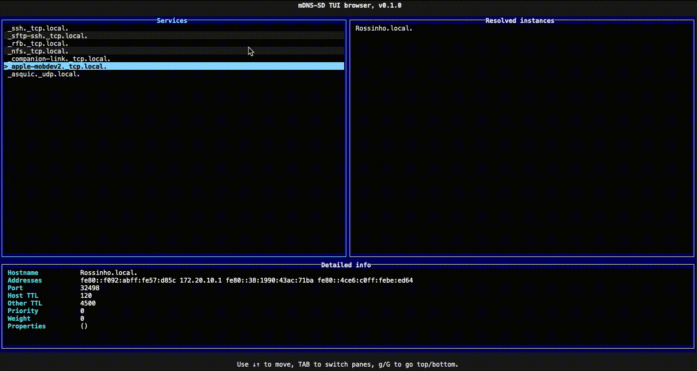

# discovery-rs

A cli utility to discover **mDNS** services on your network. Built with [Ratatui](https://ratatui.rs/) and [mDNS-SD](https://github.com/keepsimple1/mdns-sd).

## Installation

### Cargo

* Install the rust toolchain in order to have cargo installed by following
  [this](https://www.rust-lang.org/tools/install) guide.
* run `cargo install discovery-rs`

## License

Licensed under either of

* Apache License, Version 2.0
  ([LICENSE-APACHE](LICENSE-APACHE) or http://www.apache.org/licenses/LICENSE-2.0)
* MIT license
  ([LICENSE-MIT](LICENSE-MIT) or http://opensource.org/licenses/MIT)

at your option.

## Contribution

Unless you explicitly state otherwise, any contribution intentionally submitted
for inclusion in the work by you, as defined in the Apache-2.0 license, shall be
dual licensed as above, without any additional terms or conditions.

See [CONTRIBUTING.md](CONTRIBUTING.md).

## Acknowledgments

* [Slumber](https://github.com/LucasPickering/slumber). List navigation code.
